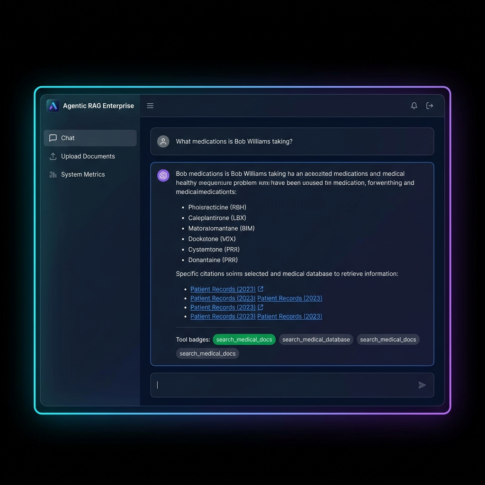

# Dual-Domain Agentic RAG Platform


> **🔗 Live Demo:** [Dual-Domain-Agentic-RAG-Platform on Streamlit](https://agentic-rag-enterprise-vzbbup5nnfpezue7meh3fz.streamlit.app/) &nbsp;|&nbsp; **📊 GitHub Stats:** 

An Enterprise-grade **Agentic Retrieval-Augmented Generation (RAG)** platform that autonomously routes user queries between specialized domain vector databases and real-time live web search. 

Instead of traditional static RAG (which always searches the same database regardless of context), this platform utilizes a **ReAct Agent** powered by `LangGraph` and `GPT-OSS 120B` to dynamically reason about the user's intent and select the appropriate tool for the job.

---

## ✨ Highlights

- 🤖 **Autonomous LangGraph Agent**
- 🩺 **Healthcare + 💰 Finance domain routing**
- 🌐 **Live web search with Tavily**
- 📚 **Source-grounded responses**
- ⚡ **Groq GPT-OSS 120B + ChromaDB**

---

## 📸 Application Interface



---

## 🌟 Key Features

- **Autonomous Agentic Routing**: The AI independently decides whether to search internal Medical records, Finance documents, or the live internet.
- **Multi-Agent Toolchain**: 
  - 🏥 `search_medical_docs`: ChromaDB Vector Search across Healthcare data
  - 📊 `search_finance_docs`: ChromaDB Vector Search across Financial data
  - 🌐 `search_web`: Real-time internet search via Tavily AI Search API
- **Dynamic Ingestion Pipeline**: Real-time PDF parsing, chunking (`RecursiveCharacterTextSplitter`), and embedding (`all-MiniLM-L6-v2`) via Streamlit upload.
- **Source Citation Support**: Every AI response includes exact source citations and excerpts from the retrieved documents to prevent hallucination.
- **Premium UI**: "Midnight FinTech" glassmorphism Streamlit UI with dynamic tool badges, response latency tracking, and system metric dashboards.

## 🧠 System Architecture

```text
User Question
     │
     ▼
[ LangGraph ReAct Agent ]  <-- GPT-OSS 120B (via Groq LPU)
     │
     ├─▶ If Medical ─▶ [ Medical ChromaDB ] ─▶ Retrieve Patient Records
     ├─▶ If Finance ─▶ [ Finance ChromaDB ] ─▶ Retrieve Financial Reports
     └─▶ If General ─▶ [ Tavily Web API ]   ─▶ Retrieve Real-Time Web Data
     │
     ▼
[ Agent Synthesis ] ─▶ Final Answer with Source Citations
```

## 🛠️ Technology Stack

- **Orchestration**: LangGraph, LangChain
- **LLM**: OpenAI gpt-oss-120b (via Groq API for ultra-low latency)
- **Embeddings**: HuggingFace `all-MiniLM-L6-v2` (384-dimensional dense vectors)
- **Vector Database**: ChromaDB (Persistent local storage with metadata filtering)
- **Web Search API**: Tavily AI Search API
- **Frontend**: Streamlit with custom CSS (Glassmorphism, CSS Animations)
- **Document Processing**: PyMuPDF (`fitz`), OpenCV, Tesseract-OCR

## 🚀 Quick Start

### Prerequisites
- Python 3.9+
- Groq API Key
- Tavily API Key

### Installation

1. Clone the repository
```bash
git clone https://github.com/Shiva-keerth/Dual-Domain-Agentic-RAG-Platform.git
cd Dual-Domain-Agentic-RAG-Platform
```

2. Install dependencies
```bash
pip install -r requirements.txt
```

3. Setup Environment Variables
Create a `.env` file in the root directory:
```env
GROQ_API_KEY=your_groq_api_key_here
TAVILY_API_KEY=your_tavily_api_key_here
```

4. Run the Application
```bash
streamlit run app.py
```

## 📈 Scalability Considerations
While this prototype runs locally via Streamlit and ChromaDB, the architecture is designed to scale horizontally by replacing ChromaDB with a cloud-native vector store (e.g., Pinecone/Weaviate) and deploying the LangGraph agent as an independent FastAPI microservice.
